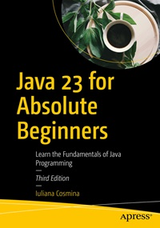

== Apress Source Code

'''

This repository accompanies book link:https://www.link.springer.com/book/10.1007/979-8-8688-1041-1[*Java for Absolute Beginners*] by Iuliana Cosmina(Apress, 2024).

Download the files as a zip using the green button, or clone the repository to your machine using Git.

=== Building and Deploying

This is a Maven multi-module project. Build it from scratch using:

[source,shell]
----
mvn clean install
----

Build it without tests using:
[source,shell]
----
mvn clean install -DskipTests
----

The default Maven goal is set to:
[source,shell]
----
clean install
----

This allows you to build the project just by running `mvn` at the root of the project.

If you want to generate and run the project site, execute:
[source,shell]
----
mvn clean install site site:stage site:run
----

The site will be available at link:http://localhost:9000[http://localhost:9000], but do not except all sections to be populated, only the `chapter09` subproject is documented.

This project does not necessarily require installing Apache Maven because it was configured to be run with an Apache Maven Wrapper. All previous commands can be  run with `./mvnw` instead of `mvn`.

*IMPORTANT:* The project was last built with the Java and Maven versions configured in the link:.sdkmanrc[.sdkmanrc] file.

==== Building using Docker

If you want to build the project using a Docker container, a Dockerfile is provided to you. Build the image using the following command (the 5th step is Maven build):
----
docker build -t java-23-bgn .
----
If you want to inspect the image contents, run the container image using:
----
docker run -it -p 9000:9000 --name java-23-bgn-build -v ${PWD}:/usr/src/java-23-for-absolute-beginners java-23-bgn
----

IMPORTANT: Or if you are using a Linux/Unix system, you can just execute the `build-and-serve.sh` provided with this project and the Docker image will be built, a container will be started and used to build the project and serve the docs at http://localhost:9000/. It might take a while, but it gets the job done.

=== Releases

*Release v3.0* corresponds to the code in the third edition of the published book, without corrections or updates.

This project was built successfully with JDK versions 23 and Maven version 4.0.0.

The syntax is specific to Java versions up to and including 23.

==== Previous Editions

* link:https://link.springer.com/book/10.1007/978-1-4842-7080-6[Java 17 for Absolute Beginners], link:https://github.com/Apress/java-17-for-absolute-beginners[(repo)]
* link:https://link.springer.com/book/10.1007/978-1-4842-3778-6[Java (11) for Absolute Beginners], link:https://github.com/Apress/java-for-absolute-beginners[(repo)]

=== Corrections

For corrections to the content in the published book, see the file link:Errata.adoc[Errata.adoc].

=== Contributions

See the file link:Contributing.adoc[Contributing.adoc] for more information on how you can contribute to this repository.